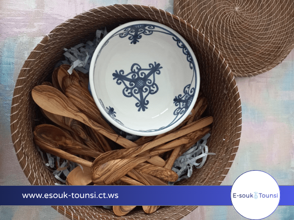

# E-Souk Tounsi

[](https://esouk-tounsi.ct.ws/public/pages/index.php)


## 🌍 Présentation

**E-Souk Tounsi** est une plateforme moderne dédiée à la valorisation de l'artisanat tunisien. Elle met en relation des artisans locaux passionnés et des amateurs d'art du monde entier, tout en préservant un patrimoine culturel unique.

> "Fondé en 2025, E-Souk Tounsi est né d'une passion profonde pour l'artisanat tunisien et d'une volonté de préserver ce patrimoine culturel inestimable."

---

## ✨ Fonctionnalités principales

- **Accueil dynamique** : Découvrez les best-sellers, l'histoire de l'artisanat tunisien et les catégories phares.
- **Catalogue de produits** : Parcourez des créations uniques, consultez les détails, ajoutez au panier ou à la wishlist.
- **Catégories variées** : Accessoires, tapis & kilims, céramiques artisanales, et plus encore.
- **Panier & Commande** : Gérez votre panier, finalisez vos achats avec paiement sécurisé (CB ou à la livraison).
- **Espace utilisateur** : Inscription, connexion, gestion du profil, suivi des commandes, wishlist.
- **Support & FAQ** : Accès à une FAQ détaillée et à un support client réactif.
- **Admin** : Gestion des produits, catégories, utilisateurs, commandes, etc.

---

## 🗂️ Structure des pages principales

- `public/pages/index.php` : Page d'accueil
- `public/pages/categories.php` : Liste des catégories
- `public/pages/category-details.php` : Détail d'une catégorie
- `public/pages/product.php` : Catalogue produits
- `public/pages/product-detail.php` : Fiche produit
- `public/pages/cart.php` : Panier
- `public/pages/checkout.php` : Paiement/Commande
- `public/pages/order_confirmation.php` : Confirmation de commande
- `public/pages/about.php` : À propos / Notre histoire
- `public/pages/vision.php` : Vision et valeurs
- `public/pages/contact.php` : Contact
- `public/pages/conditions.php` : Conditions générales de vente
- `public/user/register.php` / `login.php` / `profile.php` / `orders.php` / `faq.php` / `support.php` : Espace utilisateur
- `admin/` : Interface d'administration (gestion produits, utilisateurs, commandes...)

---

## 🛠️ Installation & Configuration

1. **Cloner le dépôt**
   ```bash
   git clone <repo-url>
   cd E-souk-main
   ```
2. **Base de données**
   - Importez le fichier `database/bd-esouk-2.sql` dans votre serveur MySQL.
3. **Configuration**
   - Modifiez `config/init.php` si besoin (chemins, URL, accès DB).
4. **Démarrage**
   - Placez le projet dans votre serveur local (ex: XAMPP `htdocs`).
   - Accédez à `http://localhost/E-souk-main/public/pages/index.php`.

---

## 🧩 Technologies utilisées

- **Backend** : PHP (PDO, sessions)
- **Frontend** : HTML5, CSS3, Bootstrap, JS (vanilla)
- **Base de données** : MySQL
- **Autres** : FontAwesome, SVG, responsive design

---

## 📚 Aide & Support

- [FAQ](public/user/faq.php) : Questions fréquentes (compte, commandes, retours, paiement...)
- [Support](public/user/support.php) : Formulaire de contact et assistance
- [Conditions générales](public/pages/conditions.php)

---

## 👥 Équipe

- **Fedi Riahi** — Développeur Full Stack
- **Aziz Jrad** — Développeur Web

---

## 📸 Aperçu



---

## 📄 Licence

Projet académique — Tous droits réservés E-Souk Tounsi.

---

## 💡 Contribuer

Toute suggestion ou contribution est la bienvenue !

---

## 📞 Contact

- Email : aziz.jrad@esen.tn
- Linkedin(https://www.linkedin.com/in/azizjrad/)

---

> Merci de soutenir l'artisanat tunisien 🇹🇳
